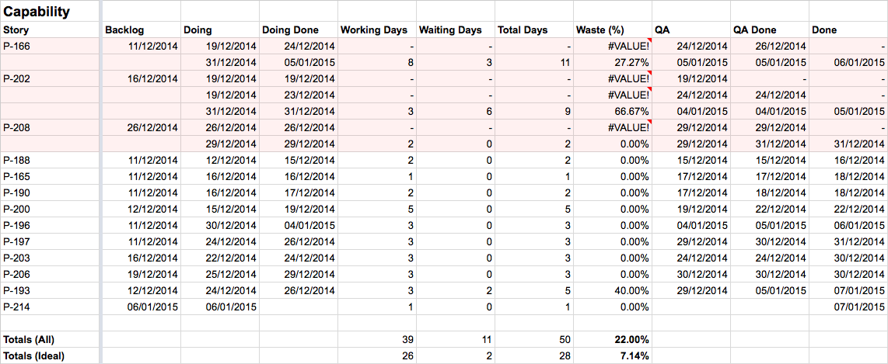
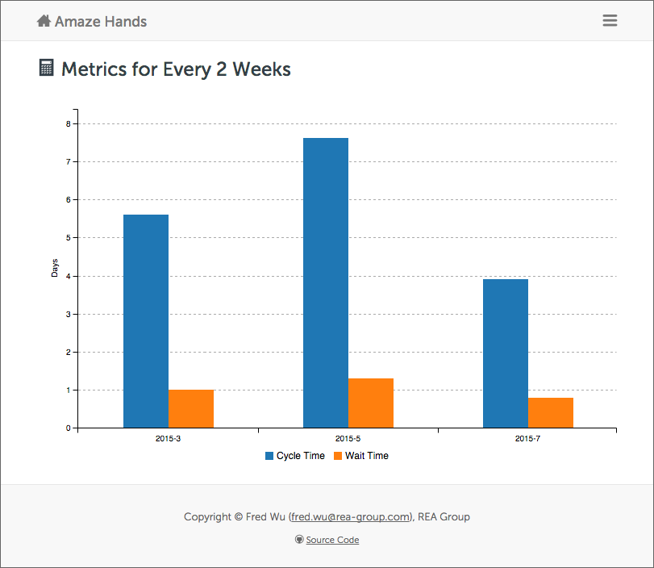
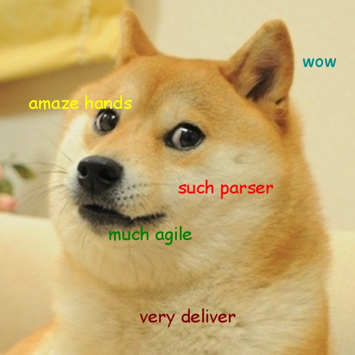

# Amaze Hands [](https://codeclimate.com/github/fredwu/amaze_hands) [](https://travis-ci.org/fredwu/amaze_hands) [](https://codeclimate.com/github/fredwu/amaze_hands)

Amaze Hands is an amazing tool developed for analysing Kanban board cards, in a similar fashion to poker [hands](http://en.wikipedia.org/wiki/Glossary_of_poker_terms#hand) analysis.

Developed exclusively for the amazing Pricing squad in Group Platform at [REA](http://www.rea-group.com/).

## Why?

_Lorem ipsum spreadsheet amaze._

Previously, as a [Delivery Lead](https://www.google.com.au/search?tbm=isch&q=spreadsheet+slave) I spent a significant portion of my time manually recording card dates and working out the cycle time and wait time. LeanKit unfortunately does not help much - its reporting tool is very basic and somewhat inaccurate.

Below is the spreadsheet I used - Excel formulas are helpful, but punching in dates is an extremely tedious process.



## Amaze Hands to the Rescue

__The goal of Amaze Hands is to incrementally add intelligence to our agile process.__

By incrementally adding areas and/or data points for analysis, we will be able to zero in on the problematic areas of our agile process. The following is a list of possible areas we can analyse on:

- cycle time
- wait time
- blocked time
- knocked-back time
- context switch (between different streams of work)
- other factors such as meetings, etc
- etc, etc



## How?

_Lorem ipsum copy paste amaze._

Even though LeanKit does offer an XML export function for exporting card history, the function is broken therefore Amaze Hands relies on copy-pasted card history text from each card to process the data and generate metrics.

Below is a high level system architecture diagram that shows how Amaze Hands handles data.

        +---------------------+
        |        Text         | <- Raw text input.
        +----------+----------+
                   |
    +--------------v--------------+
    |         Strategies          |
    +-----------------------------+
    |   +---------------------+   |
    |   |       Parser        |   | <- Parses text into an AST.
    |   +----------+----------+   |
    |              |              |
    |   +----------v----------+   |
    |   |     Transformer     |   | <- Transforms the AST into a common AST.
    |   +---------------------+   |
    +--------------+--------------+
                   |
        +----------v----------+
        |       Builder       | <- Builds the dataset from the common AST.
        +----------+----------+
                   |
        +----------v----------+
        |       Reducer       | <- Filters the dataset.
        +----------+----------+
                   |
        +----------v----------+
        |      Analyser       | <- Analyses the dataset for metrics.
        +----------+----------+
                   |
        +----------v----------+
        |      Producer       | <- Produces metrics.
        +----------+----------+
                   |
        +----------v----------+
        |      Presenter      | <- Presents metrics.
        +---------------------+

## Supported Kanban Boards

Amaze Hands out of the box has parser and transformer strategies for the following tools:

- [LeanKit](http://leankit.com/)

## Stack

Amaze Hands is proudly built with:

- Ruby 2.1+
- [Lotus](http://lotusrb.org/)
- [Parslet](http://kschiess.github.io/parslet/) for [PEG](http://en.wikipedia.org/wiki/Parsing_expression_grammar)
- [C3.js](http://c3js.org/)
- [Bootstrap](http://getbootstrap.com/)
- [RUI](http://rea.to/rui)

## How to Use

### Run Metrics in CLI

```
bundle install
lotus c
```

```ruby
# in lotus repl
Workflow.new(
  strategy: Strategies::LeanKit,
  files:    Dir["#{__dir__}/db/cards/*.txt"]
).metrics
```

### Run Metrics in Local Web App

```
bundle install
lotus s
```

## Credits

- [Fred Wu](http://fredwu.me/) - author.
- [REA Group](http://www.rea-group.com/) - where Amaze Hands was built.

## License

Licensed under [MIT](http://fredwu.mit-license.org/)


